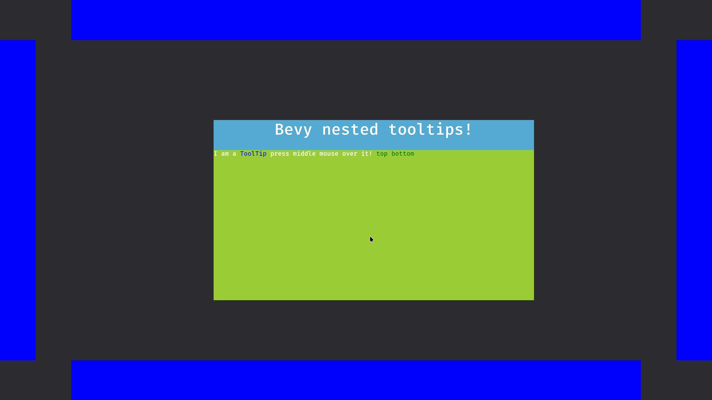

# Bevy Nested Tooltips
[](https://github.com/Lyndon-Mackay/bevy_nested_tooltips/)
[](https://crates.io/crates/bevy_nested_tooltips)
[](https://docs.rs/bevy_nested_tooltips)

A library for creating headless(unstyled) tooltips that can be arbitrarily nested and highlight other nodes.

(Colours are chosen by end user!)


## Features
This library strives to handle the logic behind common tooltip features, while you focus on your unique data and design needs.

- Tooltips can be spawned by hovering or by user pressing the middle mouse button, your choice which and you can change at runtime.
- Nesting to arbitrary levels, the only limitation is memory.
- Despawns if the user hasn't interacted with them in a configurable time period, or they mouse away after interacting with them.
- Locking by pressing of the middle mouse button. using observers you can implement your specific design to inform your users.
- Highlight other Entites using a linked text, highlight designs are up to you.
- Tooltips that are locked can be clicked and dragged around.

## Usage

### Import the prelude
```rust
use bevy_nested_tooltips::prelude::*;
```
### Add the plugin

```rust
        .add_plugins((
            NestedTooltipPlugin,
        ))
```

### (Optional) Configure tooltips
```rust
    commands.insert_resource(TooltipConfiguration {
        activation_method: ActivationMethod::MiddleMouse,
        ..Default::default()
    });
```

### Load your tooltips

```rust
    let mut tooltip_map = TooltipMap {
        map: HashMap::new(),
    };

    tooltip_map.insert(
        "tooltip".into(),
        TooltipsData::new(
            "ToolTip",
            vec![
                TooltipsContent::String("A way to give users infomation can be ".into()),
                TooltipsContent::Term("recursive".into()),
                TooltipsContent::String(" Press middle mouse button to lock me. ".into()),
            ],
        ),
    );

    tooltip_map.insert(
        "recursive".into(),
        TooltipsData::new(
            "Recursive",
            vec![
                TooltipsContent::String("Tooltips can be ".into()),
                TooltipsContent::Term("recursive".into()),
                TooltipsContent::String(
                    " You can highlight specific ui panels with such as the ".into(),
                ),
                TooltipsContent::Highlight("sides".into()),
                TooltipsContent::String(" Press middle mouse button to lock me. ".into()),
            ],
        ),
    );
```
### Add links to relevant entities
```rust
TooltipHighlight("sides".into()),
```
Or 
```rust
 TooltipTermLink::new("tooltip"),
```

### Style your tooltips
Create an observer with at least these parameters.
```rust
fn style_tooltip(
    new_tooltip: On<TooltipSpawned>,
    tooltip_info: TooltipEntitiesParam,
    mut commands: Commands,
)
```
Fetch the data.
```rust
    let tooltip_info = tooltip_info
        .tooltip_child_entities(new_tooltip.entity)
        .unwrap();
```
Use the entities to style your node using commands or mutatable queries!
```rust
    commands
        .get_entity(tooltip_info.title_node)
        .unwrap()
        .insert(Node {
            display: Display::Flex,
            justify_content: JustifyContent::Center,
            width: Val::Percent(100.),
            ..Default::default()
        });
```

#### React to changes.

```rust
// When highlighted change the colour, how you highlight is up to you
// maybe fancy animations
fn add_highlight(side: On<Add, TooltipHighlighting>, mut commands: Commands) {
    commands
        .get_entity(side.entity)
        .unwrap()
        .insert(BackgroundColor(GREEN.into()));
}

// remove highlighting
fn remove_highlight(side: On<Remove, TooltipHighlighting>, mut commands: Commands) {
    commands
        .get_entity(side.entity)
        .unwrap()
        .insert(BackgroundColor(BLUE.into()));
}
```

## Limitations

This plugin assumes a single fullscreen and camera is used.


## `Bevy` compatability

| `bevy` | `bevy_nested_tooltips` |
|-------|-------------------|
| 0.19  | 0.4-0.5  |
| 0.18  | 0.3      |
| 0.17  | 0.1-0.2  |
